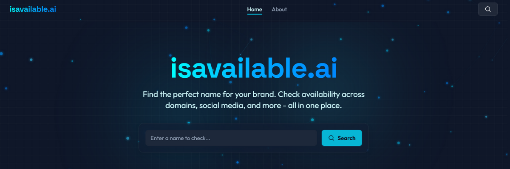

<div align="center">
  
  <h1>isavailable.ai</h1>
  <p>Find the perfect name for your brand. Check availability across domains, social media, and more - all in one place.</p>
  <a href="https://isavailable.ai">Visit isavailable.ai</a> | 
  <a href="https://github.com/Mizokuiam/isavailable.ai">GitHub</a> | 
  <a href="https://isavailable.ai/docs">Documentation</a>
  
  <p>
    
    
    
    
  </p>
</div>

---

## 📋 Table of Contents

1. [Introduction](#1-introduction)
2. [Features](#2-features)
3. [Tech Stack](#3-tech-stack)
4. [Getting Started](#4-getting-started)
   - [Prerequisites](#prerequisites)
   - [Installation](#installation)
   - [Environment Variables](#environment-variables)
   - [Running Locally](#running-locally)
5. [Architecture](#5-architecture)
6. [API Documentation](#6-api-documentation)
7. [Deployment](#7-deployment)
8. [Contributing](#8-contributing)
9. [Roadmap](#9-roadmap)
10. [License](#10-license)
11. [Acknowledgements](#11-acknowledgements)
12. [Contact](#12-contact)

---

## 1. Introduction

**isavailable.ai** is a powerful tool designed to help entrepreneurs, developers, and marketers find the perfect name for their brand or project. With a single search, you can check name availability across multiple domain extensions and social media platforms simultaneously.

Born out of the frustration of manually checking dozens of sites when launching a new project, isavailable.ai streamlines this process into seconds, saving you valuable time and helping you secure your digital identity across the web.

Our mission is to simplify the brand naming process and help creators establish a consistent online presence from day one.

---

## 2. Features

### 2.1 Comprehensive Availability Checking
- 30+ domain extensions (.com, .net, .org, .io, etc.)
- 15+ social media platforms (Twitter, Instagram, GitHub, etc.)
- Real-time verification with multiple methods

### 2.2 Advanced Search Capabilities
- Instant results with high accuracy
- Filter by domains, social media, or available options
- Detailed availability status for each platform

### 2.3 User Experience
- Clean, intuitive interface
- Responsive design for all devices
- Interactive particle network background
- Command menu for quick navigation

### 2.4 Performance & Reliability
- Optimized API with rate limiting
- Result caching for improved performance
- Multiple verification methods for accuracy
- Graceful error handling

---

## 3. Tech Stack

isavailable.ai is built with modern technologies focused on performance, scalability, and developer experience:

### 3.1 Frontend
- [Next.js 14](https://nextjs.org/) - React framework with App Router
- [TypeScript](https://www.typescriptlang.org/) - Type-safe JavaScript
- [Tailwind CSS](https://tailwindcss.com/) - Utility-first CSS framework
- [Framer Motion](https://www.framer.com/motion/) - Animation library
- [shadcn/ui](https://ui.shadcn.com/) - UI component system

### 3.2 Backend
- [Next.js API Routes](https://nextjs.org/docs/api-routes/introduction) - Serverless functions
- [Node.js](https://nodejs.org/) - JavaScript runtime

### 3.3 Infrastructure
- [Vercel](https://vercel.com/) - Deployment and hosting
- [GitHub Actions](https://github.com/features/actions) - CI/CD

---

## 4. Getting Started

### 4.1 Prerequisites

Before you begin, ensure you have the following installed:
1. [Node.js](https://nodejs.org/) (v18.17.0 or higher)
2. [npm](https://www.npmjs.com/) (v9.0.0 or higher) or [yarn](https://yarnpkg.com/) (v1.22.0 or higher)
3. [Git](https://git-scm.com/)

### 4.2 Installation

```bash
# Clone the repository
git clone https://github.com/Mizokuiam/isavailable.ai.git

# Navigate to the project directory
cd isavailable.ai

# Install dependencies
npm install
# or
yarn install
```

### 4.3 Environment Variables

Create a `.env.local` file in the root directory with the following variables:

```
# Base URL
NEXT_PUBLIC_BASE_URL=http://localhost:3000

# API Rate Limiting
RATE_LIMIT_REQUESTS=20
RATE_LIMIT_INTERVAL=60000

# Optional: Analytics
NEXT_PUBLIC_ANALYTICS_ID=your-analytics-id
```

### 4.4 Running Locally

```bash
# Start the development server
npm run dev
# or
yarn dev

# Build for production
npm run build
# or
yarn build

# Start the production server
npm start
# or
yarn start
```

The application will be available at `http://localhost:3000`.

---

## 5. Architecture

isavailable.ai follows a modern architecture pattern:

```
┌─────────────────────────────────┐
│           Client Side           │
│  (Next.js App Router, React)    │
└───────────────┬─────────────────┘
                │
                ▼
┌─────────────────────────────────┐
│         Server Components       │
│     (Next.js, TypeScript)       │
└───────────────┬─────────────────┘
                │
                ▼
┌─────────────────────────────────┐
│           API Routes            │
│    (Next.js API, TypeScript)    │
└───────────────┬─────────────────┘
                │
                ▼
┌─────────────────────────────────┐
│       External Services         │
│  (DNS, WHOIS, Platform APIs)    │
└─────────────────────────────────┘
```

### 5.1 Key Architectural Decisions

1. **Server Components**: Leveraging Next.js App Router for improved performance and SEO
2. **API-First Design**: Clean separation between frontend and backend
3. **Progressive Enhancement**: Core functionality works without JavaScript
4. **Responsive Design**: Mobile-first approach for all screen sizes
5. **Accessibility**: WCAG 2.1 AA compliance throughout the application

---

## 6. API Documentation

isavailable.ai offers a RESTful API for developers who want to integrate availability checking into their own applications.

### 6.1 Base URL
```
https://isavailable.ai/api/v1
```

### 6.2 Authentication
API requests require an API key. You can obtain one by signing up for a Pro or Business plan.

```
Authorization: Bearer YOUR_API_KEY
```

### 6.3 Endpoints

#### 6.3.1 Check Availability
```
POST /check
```

Request body:
```json
{
  "name": "example",
  "domains": ["com", "net", "org"],
  "social": ["twitter", "instagram", "github"]
}
```

Response:
```json
{
  "results": {
    "domains": {
      "com": false,
      "net": true,
      "org": true
    },
    "social": {
      "twitter": false,
      "instagram": true,
      "github": false
    }
  }
}
```

For complete API documentation, visit [isavailable.ai/docs/api](https://isavailable.ai/api).

---

## 7. Deployment

isavailable.ai is optimized for deployment on Vercel:

### 7.1 Vercel Deployment

```bash
# Install Vercel CLI
npm install -g vercel

# Deploy to Vercel
vercel
```

For production deployment:
```bash
vercel --prod
```

### 7.2 Alternative Deployment Options

1. **Netlify**: Compatible with minimal configuration
2. **AWS Amplify**: Supported with custom build settings
3. **Docker**: Dockerfile included for containerized deployment

---

## 8. Contributing

We welcome contributions from the community! Here's how you can help:

1. **Fork** the repository
2. **Clone** your fork to your local machine
3. **Create** a new branch (`git checkout -b feature/amazing-feature`)
4. **Commit** your changes (`git commit -m 'Add some amazing feature'`)
5. **Push** to the branch (`git push origin feature/amazing-feature`)
6. **Open** a Pull Request

Please read our [CONTRIBUTING.md](CONTRIBUTING.md) for detailed guidelines.

---

## 9. Roadmap

We're constantly working to improve isavailable.ai. Here's what's coming next:

### 9.1 Upcoming Features

1. **User Authentication**: Save and manage your searches
2. **Batch Checking**: Check multiple names at once
3. **Export Functionality**: Download results in CSV/PDF
4. **Domain Registration**: Direct links to register available domains
5. **Name Suggestions**: AI-powered name recommendations
6. **Advanced Analytics**: Insights on name popularity and trends
7. **Browser Extension**: Quick checks from any webpage
8. **Mobile App**: Native iOS and Android applications

---

## 10. License

This project is licensed under the MIT License - see the [LICENSE](LICENSE) file for details.

---

## 11. Acknowledgements

### 11.1 Technologies

1. [Next.js](https://nextjs.org/) - The React framework
2. [Tailwind CSS](https://tailwindcss.com/) - CSS framework
3. [shadcn/ui](https://ui.shadcn.com/) - UI components
4. [Framer Motion](https://www.framer.com/motion/) - Animation library
5. [Lucide Icons](https://lucide.dev/) - Beautiful icons
6. [Vercel](https://vercel.com/) - Deployment platform

### 11.2 Community

Special thanks to all our [contributors](https://github.com/Mizokuiam/isavailable.ai/graphs/contributors) and early users who provided valuable feedback.

---

## 12. Contact

### 12.1 Official Channels

1. **Website**: [isavailable.ai](https://isavailable.ai)
2. **Email**: hello@isavailable.ai
3. **Twitter**: [@isavailableai](https://twitter.com/isavailableai)
4. **GitHub**: [Mizokuiam/isavailable.ai](https://github.com/Mizokuiam/isavailable.ai)

### 12.2 Support

For bug reports and feature requests, please use our [issue tracker](https://github.com/Mizokuiam/isavailable.ai/issues).

---

<div align="center">
  <p>© 2023 isavailable.ai. All rights reserved.</p>
</div>